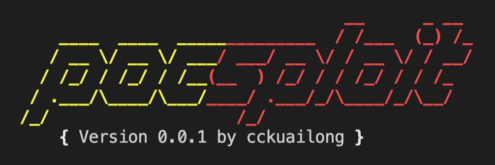

# pocsploit

[中文 README](README_zh.md)

<h1 align="center">
  <br>
  </a>
</h1>

<h4 align="center">pocsploit is a lightweight, flexible and novel open source poc verification framework</h4>

<p align="center">


</p>

## Pain points of the POC framework in the market

1. There are too many params, I don't know how to get started, but only some of them are commonly used.
2. YAML poc framework(like nuclei & xray) is not flexible enough. the conversion cost is very high when writing poc. Sometimes it's hard when encountering non-http protocols. (only hex can be used)
3. Sometimes POC has false positives, which can be avoided by accurate fingerprint matching.
4. It is heavily dependent on the framework. Poc in pocsploit can be used in the framework and can also be used alone.

## Advantages of pocsploit

1. Lighter, does not depend on the framework, a single poc can run
2. Easier to rewrite Poc
3. More flexible (compared to nuclei, xray, goby, etc.)
3. Fewer false positives, providing fingerprint prerequisite judgment, you can first judge whether the site has the fingerprint of a certain component, and then perform POC verification, which is more accurate
4. There are many ways to use, providing poc / exp
5. Detailed vulnerability information display
6. Poc ecological sustainability: I will continue to update the Poc to modules/, and welcome everyone to join us

[Contribute Poc](https://github.com/cckuailong/pocsploit/pulls/new)
Encountered code/poc issues, please [Submit issue](https://github.com/cckuailong/pocsploit/issues/new)

## Poc Statistics

|  cve   | cnnvd  | others |
|--------|--------|--------|
|   239  |   7    |   100  |

## Usage

### Install requirements

```
pip3 install -r requirements.txt
```

- poc to verify single website

```
python3 pocsploit.py -iS "http://xxxx/" -r "modules/" -t 100 --poc
```

- specific poc

```
python3 pocslpoit.py -iS "http://xxxxx" -r "modules/vulnerabilities/thinkphp/thinkphp-5022-rce.py" --poc
```

- exp to exploit many websites (with urls in a file)

```
python3 pocslpoit.py -iF "urls.txt" -r "modules/vulnerabilities/" --exp
```

- Turn on fingerprint pre-verification, verify the fingerprint first, and then enter the poc verification after matching

```
python3 pocslpoit.py -iS "http://xxxxx" -r "modules/vulnerabilities/thinkphp/thinkphp-5022-rce.py" --poc --fp
```

- Output to file & console quiet mode

```
python3 pocslpoit.py -iS "http://xxxx" -r "modules/vulnerabilities/" --poc -o result/result.log -q
```

- Other Usage

```
python3 pocsploit.py --help
```


## others

### OOB

Please config conf/config.py

P.S. How to build your own DNSLog，please visit [Hyuga-DNSLog](doc/DNSLog.md)

- DNSLOG_URI: DNSLog Address
- DNSLOG_TOKEN: Token
- DNSLOG_IDENTIFY: your identity

<p align="center">
<a href="https://github.com/cckuailong/pocsploit/graphs/contributors">
  
</a>
</p>

## License

pocsploit is distributed under [MIT License](LICENSE)

## Repobeats

