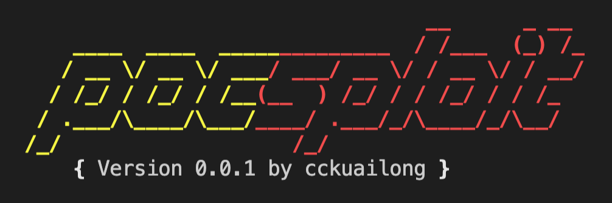
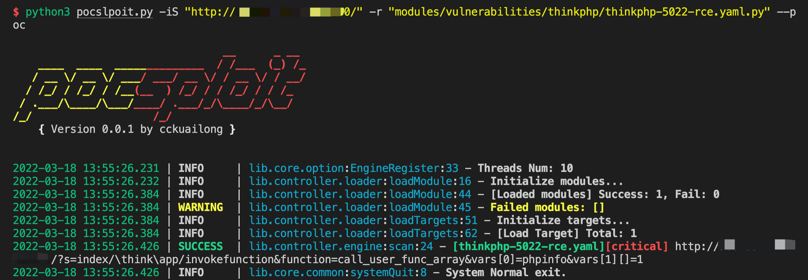

# pocsploit

[English README](README.md)

<h1 align="center">
  <br>
  </a>
</h1>

<h4 align="center">pocsploit是一款轻量，灵活，新颖的开源poc验证框架</h4>

<p align="center">


</p>

## 市面poc框架痛点

1. 功能太多，不知道怎么上手，常用的参数就那么些
2. yaml poc框架不够灵活，写poc的时候转换成本很高，有时遇到非http协议更是头疼（只能用hex）
3. 有时poc会有误报，可以通过精准的组件指纹匹配来规避
4. 重度依赖框架，不能做到单个poc，既能在框架使用，又能单独使用

## pocsploit的优势

1. 更轻量，不依赖于框架，单个poc就能跑
2. 更易改写Poc（市面上开源的Poc用python写的较多，更易于改写）
3. 更灵活（相较于nuclei，xray，goby等）
3. 少误报，提供fingerprint先决判断，可以先判断站点是不是有某个组件的指纹，再进行poc验证，更加准确
4. 方式多，提供poc / exp两种 验证 / 攻击方式
5. 详尽的漏洞信息展示
6. Poc生态持续性：我会持续更新poc到modules/中，也欢迎大家一起 [提交Poc](https://github.com/cckuailong/pocsploit/pulls/new)

遇到代码/poc问题，请 [提交issue](https://github.com/cckuailong/pocsploit/issues/new)

## Poc 统计

|  cve   | cnnvd  | others |
|--------|--------|--------|
|   312  |   7    |   100  |

## 使用说明

### 安装依赖

```
pip3 install -r requirements.txt
```

- poc方式验证单个网站

```
python3 pocsploit.py -iS "http://xxxx/" -r "modules/" -t 100 --poc
```

- 指定poc验证

```
python3 pocslpoit.py -iS "http://xxxxx" -r "modules/vulnerabilities/thinkphp/thinkphp-5022-rce.py" --poc
```

- exp方式验证多个url，通过文件获取url列表，一个url一行

```
python3 pocslpoit.py -iF "urls.txt" -r "modules/vulnerabilities/" --exp
```

- 开启fingerprint预验证，先验证指纹，匹配后进入poc验证

```
python3 pocslpoit.py -iS "http://xxxxx" -r "modules/vulnerabilities/thinkphp/thinkphp-5022-rce.py" --poc --fp
```

- 输出到文件 & 控制台静默模式

```
python3 pocslpoit.py -iS "http://xxxx" -r "modules/vulnerabilities/" --poc -o result/result.log -q
```

- 具体参数及含义参见help

```
python3 pocsploit.py --help
```



## 其他

### OOB配置

请配置 conf/config.py

设置DNSLog的地址，身份编号和Token

P.S. DNSLog搭建方式，参见 [Hyuga-DNSLog部署](doc/DNSLog.md)

- DNSLOG_URI: DNSLog 地址
- DNSLOG_TOKEN: Token
- DNSLOG_IDENTIFY: 身份编号

<p align="center">
<a href="https://github.com/cckuailong/pocsploit/graphs/contributors">
  
</a>
</p>

## License

[MIT License](LICENSE)

## Repobeats

